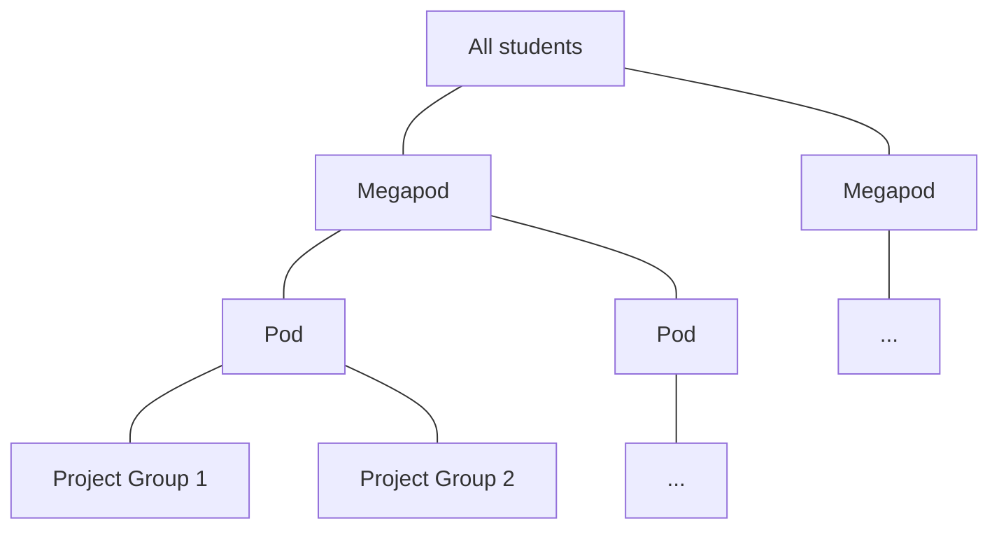

# Introduction

## Structure of Pods

## Schedule

It's recommended that you add the program calendar to your own Google calendar.

## Curriculum

* Tutorials
* Group projects
* Professional development
* More

### Projects

There is something called a project booklet in the jupyterbook that has more information
about projects, including daily guide, datatsets, and project templates.

### GPUs

They point us to the free GPUs that are available on Google Colab and Kaggle.

### Additional content

They have lots of extra content around professional development, and bonus content for
each module that might not be possible to get through during the course but will be
available to come back to.

